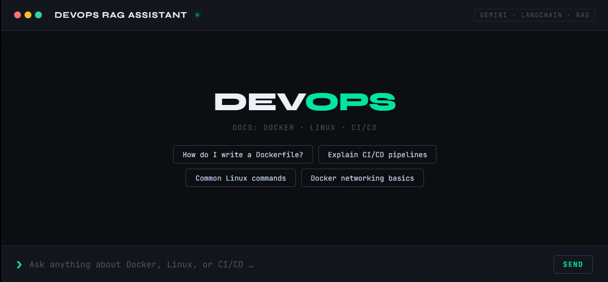

# 📚 DevOps Documentation Chatbot (RAG + Gemini + FAISS)

A lightweight **AI-powered documentation chatbot** built using **Flask, LangChain, Google Gemini, and FAISS**.

The system uses **Retrieval-Augmented Generation (RAG)** to answer questions based on your own documents. Instead of hallucinating answers, it retrieves relevant document chunks and sends them to Gemini for grounded responses.

Currently the chatbot indexes DevOps documentation such as:

* Docker
* CI/CD

But it can be extended to **any domain knowledge base**.

---



---

# 🚀 Features

• Retrieval-Augmented Generation (RAG) architecture
• Google Gemini LLM for responses
• Gemini embedding model for semantic search
• FAISS vector database for fast retrieval
• Session-based conversation memory
• Flask API backend
• Simple web UI (`index.html`)
• Source document references returned with answers
• Rate-limit safe embedding pipeline for free-tier Gemini API

---

# 🧠 Architecture

```
User Question
      │
      ▼
Flask API (/chat)
      │
      ▼
History-aware Retriever
      │
      ▼
FAISS Vector Store
      │
Retrieve Top-K Relevant Chunks
      │
      ▼
Gemini LLM (RAG Prompt)
      │
      ▼
Answer + Sources
```

This prevents hallucinations by forcing the model to **use retrieved context from your docs**.

---

# 📂 Project Structure

```
project/
│
├── docs/                     # Knowledge base documents
│   ├── docker.txt
│   └── cicid.txt
│
├── vector_store/             # Generated FAISS index
│
├── embed_docs.py             # Creates embeddings from d
├── main.py                   # Flask RAG chatbot API
├── index.html                # Frontend chat UI
├── requirements.txt          # Python dependencies
│
└── README.md
```

---

# ⚙️ Installation

### 1️⃣ Clone the repository

```bash
git clone <repo-url>
cd <project-folder>
```

---

### 2️⃣ Create virtual environment

```bash
python3 -m venv venv
source venv/bin/activate
```

Windows:

```bash
venv\Scripts\activate
```

---

### 3️⃣ Install dependencies

```bash
pip install -r requirements.txt
```

---

# 🔑 Setup Gemini API Key

Get an API key from:

[https://ai.google.dev/](https://ai.google.dev/)

Then export it as an environment variable.

ENV:

```bash
GEMINI_API_KEY="your_api_key_here"
```

---

# 📄 Add Documentation

Place `.txt` files inside the **docs/** folder.

Example:

```
docs/
   docker.txt
   cicid.txt
```

You can add any domain documents such as:

* Kubernetes
* Terraform
* Jenkins
* DevOps Interview Notes
* Internal Company Docs

---

# 🔢 Generate Vector Embeddings

Run the embedding script:

```bash
python embed_docs.py
```

What this script does:

1. Loads documents from `docs/`
2. Splits them into chunks
3. Generates embeddings using **Gemini Embedding Model**
4. Stores vectors in **FAISS**
5. Saves index in `vector_store/`

Example output:

```
Loading docs …
Loaded 2 file(s)
Split into 34 chunks
Embedding with gemini-embedding-001 …
Vector store saved to 'vector_store/'
Total vectors indexed: 34
```

---

# ▶️ Run the Chatbot

Start the Flask server:

```bash
python main.py
```

Server runs at:

```
http://localhost:5000
```


